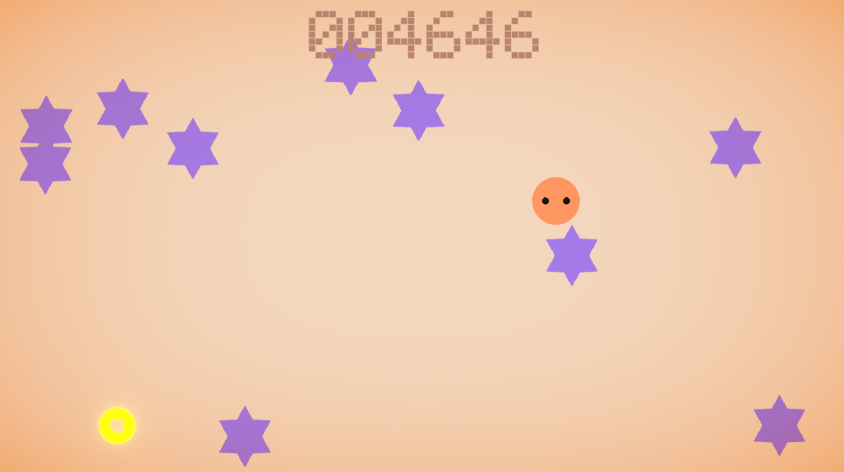

## よけとる2019夏休み課題
#### 田中　雄

---

### 作品紹介

[ゲームを遊ぶ](https://dat19.github.io/yoketoru2019summer/webgl/index.html)

---

### 開発環境
- Unity2019.1
- WebGL
- 850x480ピクセル

---

### オリジナル作品

- 前期に作成したよけとる

---

### 変更点
- グラフィックの刷新
- アイテムを取るごとに敵を増やして、徐々に難易度を上げてゲーム性を高める
- 敵をプレイヤーの近くに出現させないようにする
- 画面跳ね返りをスクリプトで実装
- 各種アニメ

---

### 解説

---

### 利用アセット
- PostProcessing Stack V2
- TextMesh Pro
  - フォントはExampleのものを利用
- ProBuilder
- [naichi. ネットランキングアセット]()
- [すずきかつーき. Googleスプレッドシートを使ったネットランキング]
