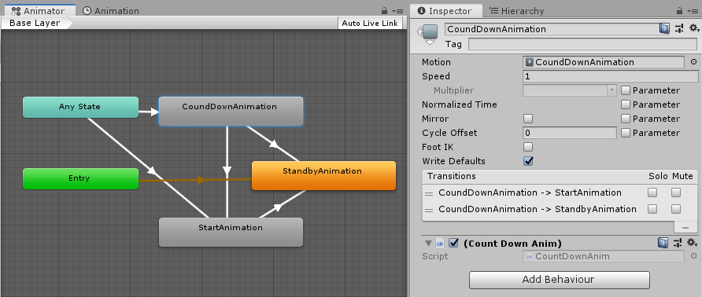

## よけとる2019SUMMER
###### - 夏休み課題 -
#### 田中　雄

[](https://dat19.github.io/yoketoru2019summer/webgl/index.html)

---

### 作品紹介


---

[ゲームを遊ぶ](https://dat19.github.io/yoketoru2019summer/webgl/index.html)

---

### 開発環境
- Unity2019.1
- WebGL
- 850x480ピクセル

---

### 原作

- 前期に作成したよけとる

---

### オリジナル要素
- グラフィックの変更
- ゲーム性の向上
  - アイテムを取るごとに敵を増やして得点アップ
- 敵や飴をプレイヤーの近くに出現させないようにする
- 画面の跳ね返りをスクリプトで実装
- 各種アニメ

---

### コード説明

---

#### プレイヤーの近くに出現させない

- 敵と飴の双方に同じ機能を持たせたい
  - `RandomPosition.cs`に機能をまとめてアタッチ

---

##### RandomPosition.cs

```cs
    public void SetPosition()
    {
        Vector3 npos = Vector3.zero;
        Transform pl = GameObject.FindGameObjectWithTag("Player").transform;

        for (int i=0; i<maxTry;i++)
        {
            npos.Set(Random.Range(-width, width), Random.Range(-height, height), 0);
            if (Vector3.Distance(pl.position, npos) >= minRange)
            {
                transform.position = npos;
                return;
            }
        }

#if UNITY_EDITOR
        Debug.LogWarning("座標設定に失敗しました。minRangeの値を小さくしてください。", gameObject);
#endif
        transform.position = npos;
    }
```

---

#### スクリプトによる跳ね返り
- プレイヤー、敵、飴のすべてで利用するので、専用のスクリプト`Bounder.cs`を作成して、それぞれにアタッチして共有

---

##### Bounder.cs

```cs
    private void FixedUpdate()
    {
        Vector3 v = rb.velocity;
        Vector3 adjustPosition = transform.position;

        // 左右に出ていないか
        if (sphereCollider.bounds.min.x < screenBounds.min.x)
        {
            v.x = Mathf.Abs(v.x);
            adjustPosition.x = screenBounds.min.x + sphereCollider.radius;
        }
        else if (sphereCollider.bounds.max.x > screenBounds.max.x)
        {
            v.x = -Mathf.Abs(v.x);
            adjustPosition.x = screenBounds.max.x - sphereCollider.radius;
        }
        // (中略)
        rb.velocity = v;
        transform.position = adjustPosition;
    }
```

---

#### カウントダウン処理
- アニメーションに[StateMachineBehaviour](https://docs.unity3d.com/ja/2017.4/ScriptReference/StateMachineBehaviour.html)をアタッチして、状態が切り替わる時に、スクリプトを実行できるようにした

---

##### Animator



---

##### CountDownAnim.cs

```cs
using System.Collections;
using System.Collections.Generic;
using UnityEngine;
using UnityEngine.Events;

public class CountDownAnim : StateMachineBehaviour
{
    public override void OnStateExit(Animator animator, AnimatorStateInfo stateInfo, int layerIndex)
    {
        GameBehaviour.CountDown();
    }
}

```

---

### 利用アセット
- BGM [魔王魂](https://maoudamashii.jokersounds.com/)
- SE [効果音ラボ](https://soundeffect-lab.info/)
- [naichi. ネットランキングアセット](https://github.com/naichilab/unity-simple-ranking/tree/ed840a13570b5f9e1cb1652996d245f60950908f)
- [divideby_zero. Googleスプレッドシートを使ったネットランキング](https://qiita.com/divideby_zero/items/50897a2695aa04bfeb69)
- PostProcessing Stack V2
- TextMesh Pro
  - フォントはExampleのものを利用
- ProBuilder
